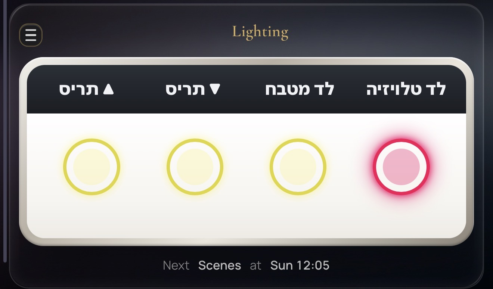
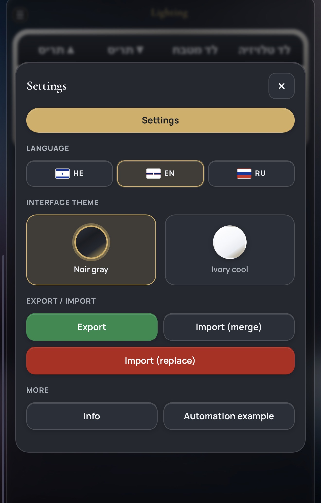
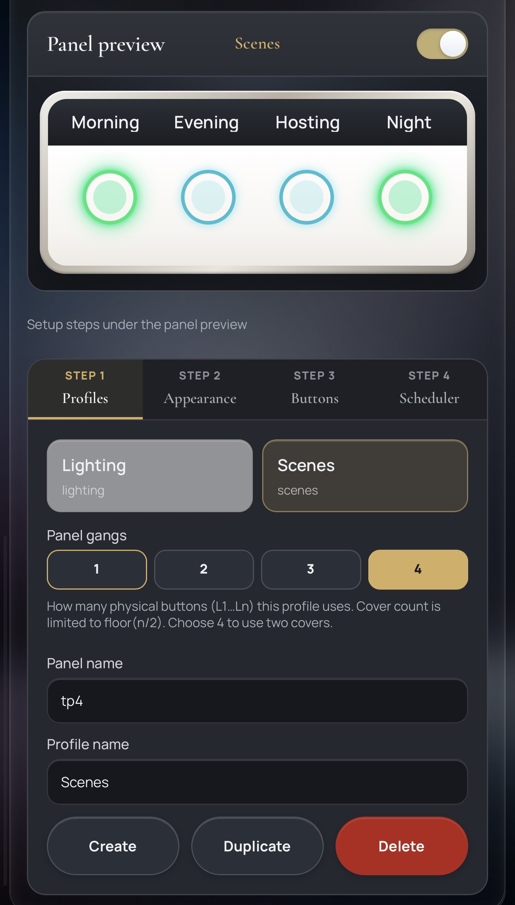
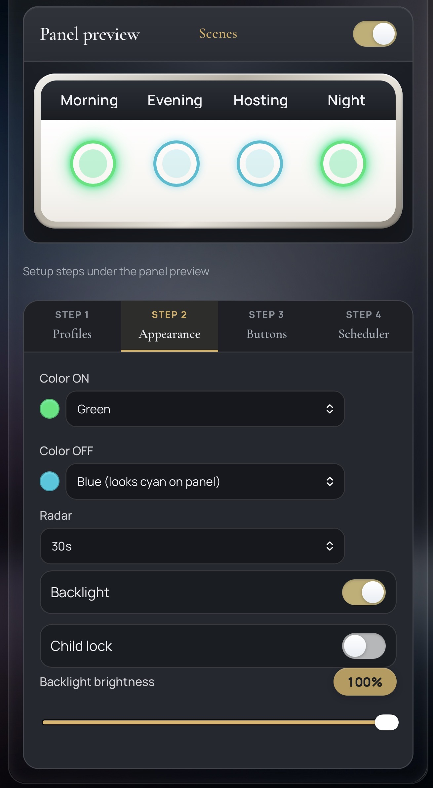
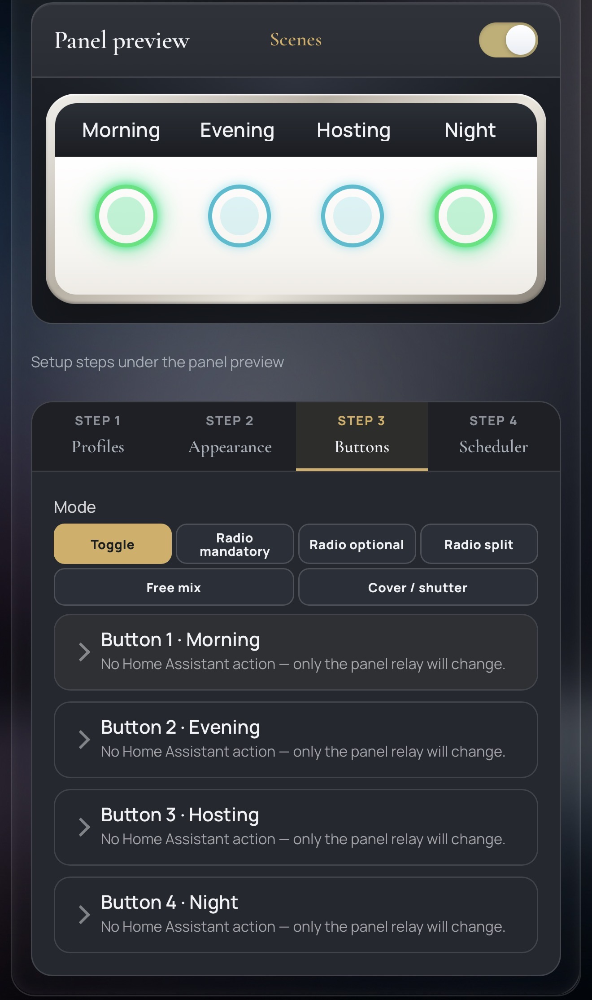
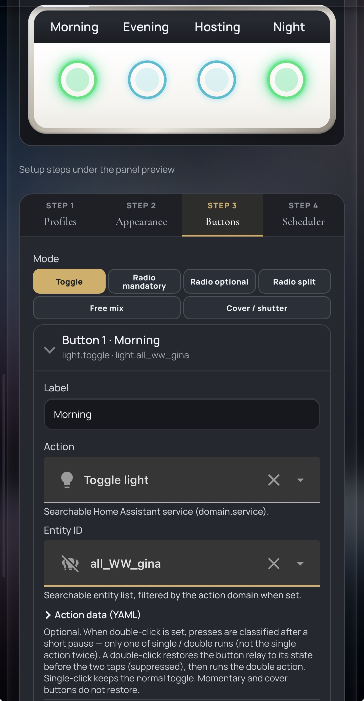
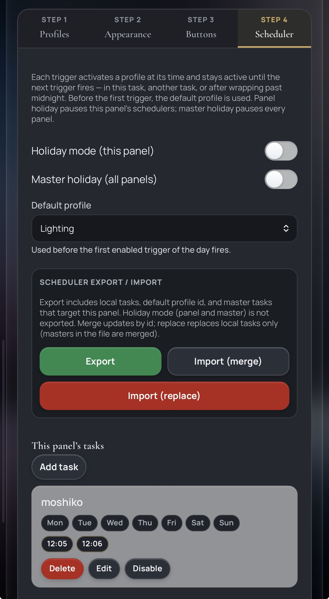
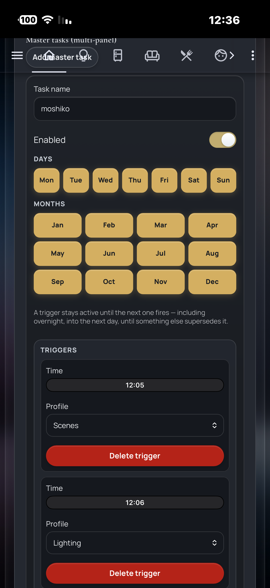

# Setup Guide (Screenshots Walkthrough)

This guide walks a first-time installer through installing **ConX Dynamic
Panel** and configuring a panel from the card, screenshot by screenshot. It
assumes you have not touched the integration before. For the terse
copy/paste install commands, see [`README.md`](../README.md#private-installation)
and [`docs/PRIVATE_DEPLOYMENT.md`](PRIVATE_DEPLOYMENT.md); this guide explains
**what you are looking at** on each screen so nothing is guesswork.

Screenshots live in [`docs/screenshots/`](screenshots/) and are referenced
below by filename.

## 0. Install the integration first

Before any of the screens below exist, the integration and the card must be
installed and added once:

1. Build and copy the integration into your Home Assistant config:
   ```bash
   ./scripts/build_frontend.sh
   ./scripts/install_local.sh /path/to/homeassistant/config
   ```
2. Restart Home Assistant.
3. **Settings → Devices & services → Add integration → ConX Dynamic Panel.**
4. Walk the Config Flow and map every required entity: the four relay
   `switch` entities (`l1`–`l4`), the four name `text` entities, and the
   shared `color_on` / `color_off` / `radar` / `backlight` / `child_lock`
   entities. Home Assistant validates each entity's domain and availability
   before letting you finish.
5. Add the card to a dashboard:
   ```yaml
   type: custom:conx-dynamic-panel-card
   entry_id: YOUR_CONFIG_ENTRY_ID
   ```
   (`entry_id` is shown on the integration's device page.)

Everything below happens **inside that card** — no more YAML editing.

## 1. The live faceplate — what the panel is doing right now



This is the card's default view: a live mirror of the physical panel. It is
not a mockup — it reflects real hardware/entity state:

- The header shows the **active profile name** (`Lighting`) and a hamburger
  menu (☰) for settings, described in the next section.
- The four rings are the physical buttons, labeled with whatever the active
  profile named them (here: תריס ▲ / תריס ▼ — cover open/close — לד מטבח,
  and לד טלויזיה). A lit ring means that button's relay is currently ON; the
  colors follow the profile's configured **Color ON** / **Color OFF**.
- The bottom line — **"Next Scenes at Sun 12:05"** — is the internal
  scheduler telling you which profile will activate next and when, computed
  from the tasks configured in Step 4 (Scheduler). It only appears when a
  scheduler task is active for this panel.
- This screen is fully bidirectional: pressing a physical button, using the
  card, or a Home Assistant automation changing a linked entity all update
  this view immediately (see the cover-sync notes in the main README).

## 2. Settings menu (☰)



Tapping the hamburger icon in the top-left opens this modal:

- **Language** — `HE` / `EN` / `RU`. Also flips the whole card to RTL for
  Hebrew. The choice is remembered in the browser (`localStorage`).
- **Interface theme** — `Noir gray` (dark) or `Ivory cool` (light); purely a
  card display preference, unrelated to hardware.
- **Export / Import** — downloads/uploads **profiles** as portable JSON.
  `Export` (green) always available. `Import (merge)` upserts profiles by id
  without touching anything not in the file. `Import (replace)` (red)
  replaces your local profile set with the file's contents — use with care.
- **Info** — opens an in-card guide explaining concepts (draft vs. sync,
  button modes, etc.) without leaving Home Assistant.
- **Automation example** — a copy-ready YAML snippet showing how to call
  `conx_dynamic_panel.activate_profile` from a Home Assistant automation
  (e.g. to switch profiles from a time trigger or another integration).

## 3. Setup wizard — Step 1: Profiles



Below the live faceplate preview sits a 4-step wizard. **Step 1** manages
profiles — the different "personalities" the same physical panel can switch
between:

- The gray/gold chips (`Lighting`, `Scenes`) list every profile on this
  panel; tap one to select it for editing. The selected chip is highlighted
  gold and its name appears above the faceplate.
- **Panel gangs** (`1` / `2` / `3` / `4`) sets how many of the physical
  buttons (L1…L4) this *profile* uses — e.g. a 1-gang profile only drives
  L1. Choosing **4** is required to use two cover pairs on one panel (cover
  count is capped at `gangs / 2`).
- **Panel name** (`tp4`) is the device-level name shown in Home Assistant;
  **Profile name** (`Scenes`) is this specific profile's display name.
- **Create** adds a new blank profile, **Duplicate** clones the selected one
  (prompting for a new name), **Delete** removes it (blocked if a scheduler
  task still references it, with a clear error listing which one).

Nothing here touches the physical panel yet — see **Draft and sync model**
in the main README. Only **Sync to Panel** writes hardware.

## 4. Setup wizard — Step 2: Appearance



Controls the LED and hardware behavior shared by all four buttons in this
profile:

- **Color ON** / **Color OFF** — the LED ring color for a button in its on
  vs. off state (dropdown of the panel's supported colors — see **Supported
  colors** in the README; note e.g. `Blue` renders as cyan on this panel
  model).
- **Radar** — the built-in presence-radar sensitivity/timeout (`30s` here).
- **Backlight** — on/off, plus **Backlight brightness** (0–100% slider,
  `100%` here) when supported.
- **Child lock** — disables physical presses on the panel while still
  allowing Home Assistant/card control.

## 5. Setup wizard — Step 3: Buttons (overview)



This is where each button's *behavior* is defined:

- **Mode** picks how the four buttons relate to each other for this profile:
  `Toggle` (each button independent, this screenshot), `Radio mandatory` /
  `Radio optional` (mutually-exclusive group, with or without an
  all-off state), `Radio split` (two independent radio groups on one
  panel), `Free mix` (each button picks its own mode individually), or
  `Cover / shutter` (pairs of buttons drive a motorized cover — open/close/
  stop, travel timing, reverse behavior).
- Below the mode picker, one collapsible row per button (`Button 1 · Morning`
  … `Button 4 · Night`) summarizes its current action in one line —
  `No Home Assistant action — only the panel relay will change` means the
  button currently just flips its own LED with no service call attached.
  Tap a row to expand it (next screenshot).

## 6. Setup wizard — Step 3: editing one button



Expanding a button row (`Button 1 · Morning`) shows its full editor:

- **Label** — the text shown on the physical button's LCD/LED area and in
  the live faceplate.
- **Action** — searchable Home Assistant service (`domain.service`, here
  `Toggle light`) to call when this button is pressed.
- **Entity ID** — searchable, filtered to the action's domain when one is
  set (here `light.all_WW_gina`; the crossed-out icon flags it as currently
  unavailable, which is only a warning, not a hard error).
- **Action data (YAML)** — optional advanced payload for the service call.
- The help text explains **double-click**: if a second, separate
  `action_double` is configured, presses within 0.4s are classified as a
  single or a double click and only the matching action fires once — the
  relay is restored to its pre-gesture state first on a double, so the
  physical LED never lies about what actually ran. Momentary and cover
  buttons never restore state this way.

## 7. Setup wizard — Step 4: Scheduler



The internal scheduler switches profiles automatically on a timetable,
without any Home Assistant automation:

- Each **task** fires one or more **triggers** — a start time plus the
  profile to activate — and that profile stays active until the *next*
  trigger fires, in this task, another enabled task, or after wrapping past
  midnight. There is no separate "end time" to configure; a trigger's effect
  simply lasts until something supersedes it.
- **Holiday mode (this panel)** pauses only this panel's scheduler tasks.
  **Master holiday (all panels)** pauses every panel's scheduler at once
  (e.g. for vacations) regardless of their individual holiday switch.
- **Default profile** is used whenever no trigger has fired yet for the day
  (i.e. before the first enabled trigger of the day).
- **Scheduler export / import** is separate from profile export/import: it
  bundles this panel's local tasks, its default profile id, and any
  multi-panel **master** tasks that target it. `Import (merge)` upserts by
  id; `Import (replace)` replaces local tasks only (master tasks in the file
  are still merged in, never wholesale-replaced, since they may affect other
  panels too).
- **This panel's tasks → Add task** opens the trigger editor shown next.

## 8. Scheduler: editing a task's triggers



Opening (or adding) a task shows:

- **Task name** (free text, e.g. `moshiko`) and an **Enabled** switch —
  disabling a task removes its triggers from consideration without deleting
  it.
- **Days** and **Months** chips filter *when* this task's triggers are
  eligible at all (all seven days / twelve months selected here means "every
  day, all year").
- **Triggers** — one card per `{time, profile}` pair (`12:05 → Scenes`,
  `12:06 → Lighting` here). **Delete trigger** removes just that one; the
  task can hold several, letting one task express a whole day's rotation
  (e.g. morning/evening/night) without juggling multiple tasks.
- The reminder text — *"A trigger stays active until the next one fires —
  including overnight, into the next day, until something else supersedes
  it"* — is the same until-superseded rule from Step 4, restated here where
  you're actually adding times.
- This example is a **master task** (note the top toolbar shows *"Master
  tasks (multi-panel)"* and an *Add master task* button): the same task can
  target several panels at once, useful for whole-home schedules (e.g. all
  panels switch to a "Night" profile together) instead of configuring each
  panel separately.
- Saving blocks with a clear conflict message if two *enabled* triggers
  would fire different profiles at the exact same time — same-profile
  overlaps are allowed.

## Where to go next

- **README → Troubleshooting** for common symptoms (card missing, sync
  errors, RTL not applying, etc.).
- **README → Button modes** for the full semantics of Radio
  mandatory/optional/split and Cover mode.
- **`docs/PRIVATE_DEPLOYMENT.md`** for update/reinstall commands and the
  draft-vs-sync model in more depth.
